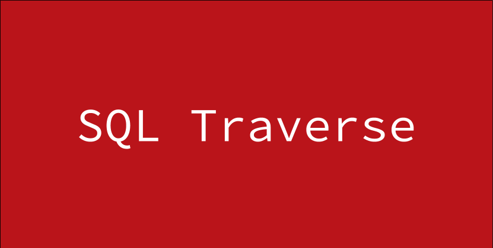

  

  <b><a href="#overview">Overview</a></b>
  |
  <b><a href="#features">Features</a></b>
  |
  <b><a href="#installation">Installation</a></b>
  |
  <b><a href="#credits">Credits</a></b>
  |
  <b><a href="#issues">Issues</a></b>

 

## Overview

<a href="#top">:arrow_up:</a>

## Features

<a href="#top">:arrow_up:</a>

## Installation

### Environment Requirements

<a href="#top">:arrow_up:</a>

### Using this project

<a href="#top">:arrow_up:</a>

### Deploy

<a href="#top">:arrow_up:</a>

## Credits

Copyright (c) 2016

## Issues
- Unit test currently not finished
- Documentation currently under construction
- AST is currently in a state of flux

<a href="#top">:arrow_up:</a>
